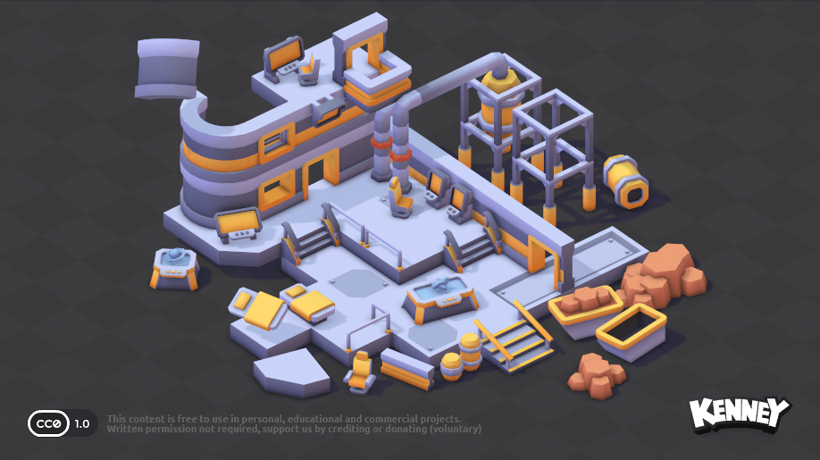
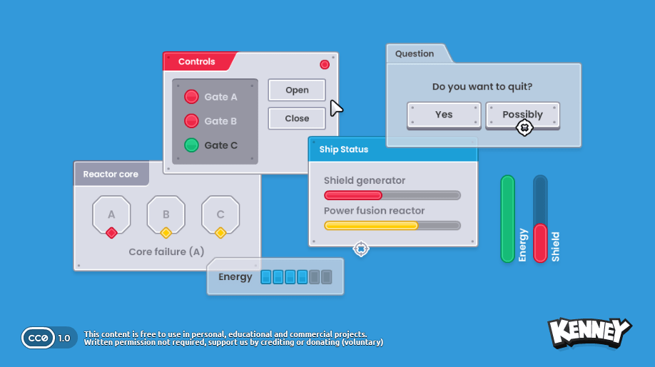

# Jeff's art references

A small selection for the team's **low-poly sci-fi** direction. These are reference/source
assets, not dependencies of Jeff_Scene. They stay outside the Unity Assets folder until chosen.

## Space Station Kit

Source: [Kenney - Space Station Kit](https://kenney.nl/assets/space-station-kit)

- Six FBX models: wall, corner wall, floor, double door, barrier, and container.
- The original shared `Models/Textures/colormap.png` is included.
- Use for corridor modules, obstacles, or a small training arena.
- Keep the silhouettes simple and tint important hazards consistently with the style guide.

## Sci-Fi UI Pack

Source: [Kenney - UI Pack - Sci-Fi](https://kenney.nl/assets/ui-pack-sci-fi)

- Two blue status bars, a glass panel, and a crosshair PNG.
- Use as references for buff duration, shield status, targeting, and menu panels.
- `Preview.png` shows the full pack; only the four PNGs under `Sprites` are included as source assets.

## Use in Unity

Copy selected assets into a new folder under `Assets/Jeff/Art` and commit their generated `.meta`
files. Keep `Textures` beside the FBX files. For URP, create a URP Lit or Unlit material and assign
the colormap as its base map if automatic material import does not match the project's pipeline.
Import UI PNGs as Sprite (2D and UI). Set slicing/borders for the intended panel size.

Both packs are by **Kenney**, released under **CC0**. Their original `License.txt` files are
included in each folder. Files are copied unchanged from the official downloads on 2026-10-07.
Attribution is optional under the supplied license, but retain these source notes for the team.

For additional visual inspiration, see [Synty - POLYGON Sci-Fi Space Pack](https://syntystore.com/products/polygon-sci-fi-space-pack).
No Synty assets are included; that pack has a separate commercial license.
